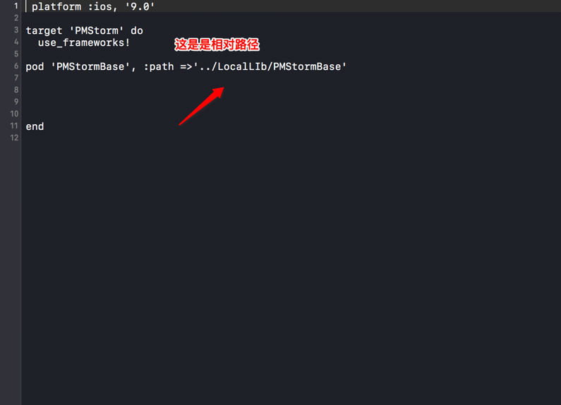

### iOS组件化探索之路(实践篇)
- 上篇主要讲了组件化的一些基本概念和解决方案,然而没有实践的支撑并没有什么卵用,本篇以图文的形式详细讲解组件化的步骤以及探索过程中的各种解决方法的对比.

#### 知识储备
- 组件化的基础是建立在cocoapods和git管理之上,但是并不需要很深入地了解才能进行组件化,本文对于必要的操作进行一个简单的介绍
- git的相关操作
  - 基本概念
      - 工作区→ 与.git文件夹同级的其他文件夹或者子文件夹
      - 版本控制库
          - 暂缓区
          - 分支
      - 切换分支→通过控制HEAD指针指向不同的分支,就可以切换*
      - ** 操作原则: 所有新添加/删除/修改的文件 必须先添加到暂缓区,然后才能提交到HEAD指向的当前分支中**
   - 常用命令
     - 初始化本地仓库→git init
     - 查看文件状态→git status
     - 添加文件到暂缓区→git add .
     - 从暂缓区提交文件到本地代码仓库→git commit -m "注释"
     - 打标签→git tag -a '标签' -m "注释"
     - 查看标签→git tag
     - 删除标签→git tag -d '标签名称'
     - 给本地仓库添加添加远程仓库关联地址→git remote add origin 远程仓库地址
     - 上传本地代码到远程仓库→git push origin master
     - 上传标签到远程仓库→git push --tags
     - 从远程仓库删除标签→git push origin :标签
- cocoapods相关操作
    - [cocoapods的安装](http://www.jianshu.com/p/6d8604f0b94c)
    - [cocoapods的使用](http://www.jianshu.com/p/44c894b69cf6)
    - cocoapods常见命令
       - 查看第三方框架仓库源→pod repo
       - 移除仓库源→pod repo remove master
       - 添加仓库源→pod repo add master http://git.oschina.net/xxxx/Specs.git
       - 初始化(下载服务器中所有第三方框架信息, 缓存到电脑本地)→pod setup
    - cocoapods重要路径
       - 索引缓存路径
           -  ~/Library/Caches/CocoaPods/
           -  如果发现框架信息本地已经缓存, 但是就是无法搜索框架, 可以删除这个索引文件, 重新生成
       - pod命令安装路径→/usr/local/bin
       - pod框架索引信息缓存路径→/Users/apple/.cocoapods/repos/master

#### 组件化方案
###### 本地化私有库方案
- 本地私有库:就是创建一个仓库, 存储在本地, 在本地的其他工程中直接使用
- 组件划分-因为主骨架依赖 一些分类, 而这些分类在其他组件中也会使用, 所以此处采用"依赖下沉"的方式, 单独剥离出一个基础组件
- 步骤
   - 1.拖入源代码文件,示例为Extension,这个为基础组件,并使用Git管理

   - 2.创建仓库描述文件 pod spec create XXX
   - 3.修改重要字段

 

   - 4.回到宿主工程,创建podfile文件,并安装pod组件

- 存在的问题
    - 上面的例子展示了最基本的组件化,存在一些问题.
        - 需要手动创建podspec文件
        - 无法测试, 需要再次手动创建测试工程
- 解决方案
  - 使用pod lib 命令创建pod库模板工程
  - 步骤
     - pod lib create XXX

     - 拖入代码到 Classes文件夹, 并删除ReplaceMe.m

     - 测试工程安装pod组件进行测试

     - 在宿主工程中, 直接测试, 没有问题后, 直接由外界以本地库的形式使用
    
###### 远程私有库方案
- 本地私有库其实存在很多问题
    - 需要主动指明路径,如果调整路径, 需要修改相关配置
    -  版本升级不好维护
    -  不好展开多人合作开发
    -  所以产生了远程私有库

- 使用远程私有库的方案
    - 远程, 是为了多人合作开发
    - 私有, 是为了只有团队内部人员可以下载
- 步骤
    1. 私有Spec Repo创建
       - 在托管平台创建一个远程私有仓库作为Spec仓库(本例为Coding)
       - 本地关联远程私有仓库 pod repo add PMStormBase https://git.coding.net/idlebook/xxxxx.git
       - 

       - 查看Spec仓库数据源→pod repo

    2. 创建Pod的所需要的项目工程文件，并上传到远程私有仓库
       - 在托管平台创建一个一个远程私有仓库作为组件仓库
       - 创建仓库工程模板→ pod lib create XXXLib
       -  添加需要的库文件到相应文件夹
       -  测试无误后, 修改Spec重要字段

       - 本地验证podspec文件→pod lib lint

       -  提交代码并上传到远程仓库
           - 关联远程库→git remote add origin https://git.coding.net/xxxxx/PMStormBase.git
           - 提交到远程仓库→git push origin master(先保证有代码)

           - 打标签, 并提交到远程仓库→**git tag -m "初始版本" -a "0.1.0"(这里的版本与spec里面的版本号一一对应)**
           - 推送tag到远程仓库→git push --tags 
    3. 向私有的Spec Repo中提交podspec

       - 远程验证podspec文件→pod spec lint

       - pod repo push PMStormBaseSpec PMStormBase.podspec

    4. 宿主工程使用pod库

       - pod search PMStormBase
       - 如果检索不到, 可以先到私有索引库内, 看看是否存在私有库
       - 如果存在还是检索不到, 则直接删除, 私有库索引文件,路径为: ~/Library/Caches/CocoaPods/ 
       - 宿主工程profile文件的配置

- 远程私有库的升级维护
   - 版本的规范,一般来说,版本为V1.2.3的格式,最后一位代表小版本的迭代(包括bug的修复、功能的迭代),中间一位的改变通常代表有一个完善的版本发布,第一位的改变通常代表重大版本的改变
   - 每次版本的改变都需要重新升级提交到远程仓库,然后打Tag,再次推送给本地私有库.
   - 其他地方使用,只需要→pod update --no-repo-update
- 远程私有库依赖问题
    - 扩充网络工具类
        - 需要依赖Alamofire、Kingfisher
        - 在关键字段加入
 
        - 升级使用的效果

- 远程私有库设计优化
   - 一个功能复杂的组件,拆分为若干个小的组件,使得更加灵活,如AFN.

   - 在PMStormBase中,有Extentions类,有工具类,但有些项目只需要工具类,这就需要子类化的组件
   - 修改spec关键字段

   - 验证、测试

- 资源加载问题
    - 1. xib加载问题
       - 所有的代码中需要填写bundle的地方, 全部需要动态获取
    - 2.图片资源存放问题
       - 所有的图片资源存放在Assets
       - 修改podspec文件

    - 3.图片资源使用问题
       - 在xib文件中,在图片名称前面添加组件主bundle
       - 代码加载图片 
           - 1. 获取当前的bundleName
           - 2. 根据图片名称, 在bundle中检索图片路径
           - 3. 通过imageWithContentOfFile获取图片
- 组件API的统一披露
    - 产生原因,组件内部提供服务很多, 但是如果他人使用, 无法确定有哪些API, 如何调用等
    - 解决方案
         - 统一披露API
         - 参考原则
               - 直接以普通方法的形式让外界调用即可
               - 让外界以block的形式, 或者通知的形式传递数据到组件内部, 内部做相应处理
- 二进制化
    - 解决问题
       - 虽然使用了组件化, 但依然是源码, 如果工程庞大, 编译速度依然非常慢
       - 所以, 可以直接把私有库打包成为一个库文件, 进行使用
    - [静态库/动态库](http://www.jianshu.com/p/155a3cfb765e)

- 组件间的通讯
   - 什么是组件间通讯?
       - 比如现在有很多业务组件, 在另外一个组件内部需要调用另外一个组件中的服务, 或者打开另外一个组件中的控制器, 并传值
       - 如果直接在另外一个组件导入了另外一个组件的头文件, 则产生了物理上的依赖关系
   - MGJRoute方案
       - 原理,通过url注册服务, 其他地方通过url, 获取服务,框架在维护一个url-block的表格
       - 特点
            - 1. 每个业务组件, 都需要依赖这个框架
            - 2. url维护成本高
            - 3. 可以在组件内部任何地方调用/注册服务, 没有必要统一组件接口服务
   - target-action方案
      - 原理
            - 额外的维护一个中间件的分类扩展,通过运行时进行物理解耦
            - 其他地方通过target-action;的方案进行交互
   - 特点
      - 统一了组件api服务
      - 组件与框架之间无依赖关系
      - 需要额外维护中间件类扩展

#### 参考资料
- [limboy-蘑菇街组件化之路](http://limboy.me/tech/2016/03/10/mgj-components.html)
- [limboy-蘑菇街组件化之路-续](http://limboy.me/tech/2016/03/14/mgj-components-continued.html)
- [Skyline75489-浅析iOS应用组件化设计](http://skyline75489.github.io/post/2016-3-16_ios_module_design.html)
- [philon-iOS组件化思路-大神博客研读和思考](http://www.jianshu.com/p/afb9b52143d4)
- [philon-iOS组件化实践方案-LDBusMediator练就](http://www.jianshu.com/p/196f66d31543)
- [bang-iOS组件化方案探索](http://blog.cnbang.net/tech/3080/)
- [携程移动端架构演进与优化之路](http://weibo.com/ttarticle/p/show?id=2309404032668823108689)

